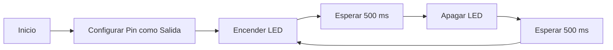
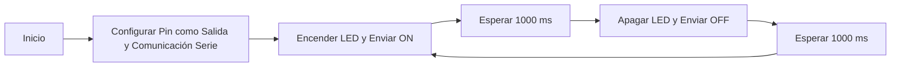
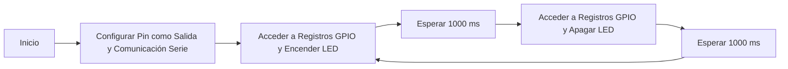
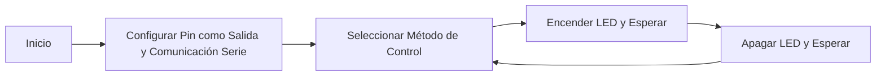

```mermaid
gantt
    title Varias Opciones de Control del LED
    dateFormat  HH:mm:ss
    section LED
    Encendido: 00:00:00, 1m
    Apagado: 01:00:00, 1m
```

# Informe Práctica 1
## Ejercicio 1

### Código 
```cpp
#include <Arduino.h>

#define LED_BUILTIN 2
#define DELAY 500

void setup() {
  // Configuración del pin como salida
  pinMode(LED_BUILTIN, OUTPUT);
}

void loop() {
  // Encender el LED
  digitalWrite(LED_BUILTIN, HIGH);
  delay(DELAY);
  
  // Apagar el LED
  digitalWrite(LED_BUILTIN, LOW);
  delay(DELAY);
} 
 ``` 

### Diagrama de Flujo

### Diagrama de Tiempo

```mermaid
gantt
    title Parpadeo LED con Delays
    dateFormat  HH:mm:ss
    section LED
    Encendido: 00:00:00, 30s
    Apagado: 00:00:30, 30s
```

## Ejercicio 2

### Código 
 ```cpp
#include <Arduino.h>

#define LED_BUILTIN 2
#define DELAY 1000

void setup() {
  // Configuración del pin como salida y la comunicación serie
  pinMode(LED_BUILTIN, OUTPUT);
  Serial.begin(115200);
}

void loop() {
  // Encender el LED y enviar mensaje
  digitalWrite(LED_BUILTIN, HIGH);
  Serial.println("ON");
  delay(DELAY);
  
  // Apagar el LED y enviar mensaje
  digitalWrite(LED_BUILTIN, LOW);
  Serial.println("OFF");
  delay(DELAY);
}
```


### Diagrama de Flujo


### Diagrama de Tiempo


```mermaid
gantt
    title Parpadeo LED con Mensajes
    dateFormat  HH:mm:ss
    section LED
    Encendido: 00:00:00, 00:01:00
    Apagado: 00:01:00, 00:01:00
```

## Ejercicio 3
### Codigo
```cpp
#include <Arduino.h>

#define LED_BUILTIN 2
#define DELAY 1000

void setup() {
  // Configuración del pin como salida y la comunicación serie
  pinMode(LED_BUILTIN, OUTPUT);
  Serial.begin(115200);
}

void loop() {
  // Definir un puntero para acceso directo al registro GPIO
  uint32_t* gpio_out = (uint32_t*)GPIO_OUT_REG;
  
  // Encender el LED manipulando directamente el registro
  *gpio_out |= (1 << LED_BUILTIN);
  Serial.println("ON");
  delay(DELAY);
  
  // Alternar el estado del LED usando XOR
  *gpio_out ^= (1 << LED_BUILTIN);
  Serial.println("OFF");
  delay(DELAY);
}
```

### Diagrama de Flujo



### Diagrama de Tiempo

```mermaid
gantt
    title Parpadeo LED con Acceso Directo a Registros
    dateFormat  HH:mm:ss
    section LED
    Encendido: 00:00:00, 1m
    Apagado: 00:01:00, 1m
```

## Ejercicio 4
### Código 
```cpp

#include <Arduino.h>

#define LED_PIN 2  // Puedes cambiar este pin a cualquier otro disponible en tu microcontrolador

void setup() {
    pinMode(LED_PIN, OUTPUT);  // Configurar el pin como salida
    Serial.begin(115200);      // Iniciar la comunicación serie
}

void loop() {
    uint32_t* gpio_out = (uint32_t*)GPIO_OUT_REG;  // Acceso directo al registro GPIO
    
    // CASO 1: Con Serial.println() y digitalWrite()
    digitalWrite(LED_PIN, HIGH);
    Serial.println("ON");
    digitalWrite(LED_PIN, LOW);
    Serial.println("OFF");

    // CASO 2: Con Serial.println() y acceso a registros
    *gpio_out |= (1 << LED_PIN);
    Serial.println("ON");
    *gpio_out &= ~(1 << LED_PIN);
    Serial.println("OFF");

    // CASO 3: Sin Serial.println() y usando digitalWrite()
    digitalWrite(LED_PIN, HIGH);
    digitalWrite(LED_PIN, LOW);

    // CASO 4: Sin Serial.println() y acceso directo a registros (Máxima velocidad)
    *gpio_out |= (1 << LED_PIN);
    *gpio_out &= ~(1 << LED_PIN);
}
```

### Diagrama de Flujo



### Diagrama de Tiempo


